# Domain Architecture Overview for Game1

## 1. Purpose

This document provides a strategic overview of the domain architecture for **Game1**, grounded in the principles of **Domain-Driven Design (DDD)**. It defines the core domain, outlines bounded contexts, maps their relationships, and clarifies the strategic roles of each context. The goal is to improve shared understanding across development, design, and strategic planning.

---

## 2. Core Domain

### 🎯 Definition

Game1's **Core Domain** is the simulation of human-like decision-making and social-economic interaction via:

- **Energy-as-Action System**
- **Deal System**
- **Individual Identity Mechanics**
- **Production and Value Creation**

These domains abstract real-world constraints such as cognitive limits, energy depletion, time preferences, and social cooperation mechanisms.

### 🔥 Why It Matters

These systems define:

- What players can do
- How they exchange value
- How effort is limited and allocated
- How social trust and productivity emerge

---

## 3. Bounded Contexts

Below are the key bounded contexts in Game1:

| Context           | Responsibility                                                               |
| ----------------- | ---------------------------------------------------------------------------- |
| **Energy System** | Manages action capacity, sleep, tokenization, and regeneration               |
| **Individual**    | Models player character, identity spectrum, skills, and psychological traits |
| **Production**    | Governs product and service creation, pausing, efficiency, complexity        |
| **Group**         | Represents collective effort, roles, specialization, internal dynamics       |
| **Deal System**   | Handles formal agreements between entities, term enforcement, reputation     |
| **Network**       | Manages connections, reputation, social capital, economic signals            |
| **Time System**   | Tracks real-time, circadian preferences, debuffs, and scheduling             |
| **Progression**   | Tracks skill evolution, diminishing returns, identity shifts                 |
| **Balance**       | Observes the ecosystem and applies balancing actions                         |

---

## 4. Context Map

### ⚡ Interaction Types

- **Energy ← Individual** — Core usage of action capacity (Customer/Supplier)
- **Production ← Energy & Individual** — Depends on their state to perform tasks (Customer/Supplier)
- **Group ← Individual** — Groups aggregate individuals (Composite)
- **Deal ↔ Group & Individual** — Mediates interactions (Mediator Pattern)
- **Progression → Individual & Production** — Learns from their activity (Observer)
- **Network ↔ Individual/Group** — Broadcasts and filters interactions (Mediator)

### 🗺 Diagram Key (Mermaid)

```mermaid
flowchart TD

%% ENTITY NODES
Individual["📍 Individual"]
EnergySystem["⚡ Energy System"]
TimeSystem["🕒 Time System"]
Production["🏭 Production System"]
Group["👥 Group"]
Deal["🤝 Deal System"]
Network["🌐 Network"]
Progression["📈 Progression System"]
Balance["⚖️ Balance Module"]

%% RELATIONSHIPS
Individual -->|uses| EnergySystem
EnergySystem -->|time-dependent| TimeSystem
Individual -->|affects| Progression
Progression -->|observes| Production
Individual -->|executes| Production
Production -->|consumes| EnergySystem
Group -->|composes| Individual
Group -->|produces with| Production
Individual -->|joins via| Deal
Group -->|manages via| Deal
Deal -->|broadcasts| Network
Network -->|updates reputation for| Individual
Deal -->|observed by| Balance
Production -->|telemetry to| Balance
Network -->|feeds metrics to| Balance
```

---

## 5. Strategic Roles

| Context           | Role       | Notes                                                      |
| ----------------- | ---------- | ---------------------------------------------------------- |
| Energy System     | Core       | Everything depends on energy capacity and regeneration     |
| Individual        | Core       | Represents the atomic decision-maker and capability holder |
| Production System | Core       | Primary means of expressing effort into value              |
| Group             | Supporting | Aggregates individuals, increases complexity potential     |
| Deal System       | Supporting | Orchestrates formal cooperation                            |
| Network           | Generic    | Supports communication, reputation, and value propagation  |
| Time System       | Generic    | Provides shared rhythm, buffs/debuffs, scheduling          |
| Progression       | Supporting | Emergent identity and capability evolution                 |
| Balance           | Generic    | Regulates feedback but not part of core gameplay decisions |

---

## 6. Capability Map

| Capability                    | Implemented In            |
| ----------------------------- | ------------------------- |
| Manage personal energy        | Energy, Individual        |
| Create products/services      | Production, Individual    |
| Form and operate groups       | Group, Deal               |
| Make and enforce agreements   | Deal System, Network      |
| Trade and transmit value      | Energy (tokens), Network  |
| Build identity and reputation | Individual, Network       |
| Learn and specialize          | Progression, Production   |
| Observe and adapt systems     | Balance, Deal, Production |

---

## 7. Integration Guidelines

- Use **published interfaces** between contexts
- Communicate using **event-based messaging** (Observer Pattern across modules)
- Apply **Mediator Pattern** for orchestrated systems like Deals & Network
- Maintain **aggregate roots** (e.g., Group, Individual) for consistency boundaries

### Example: GameEngine

- Central entry point (`gameEngine.ts`) initializes and wires up all modules
- Uses `IGameContext` to expose `eventBus`, `timeSystem`, and module registry
- Enables creation of entities via factories (`defineIndividual`, `defineGroup`)
- Drives time progression, action execution, and persistence

---

## 8. Freedom & Entropy Control via Action System

### Problem:

Max freedom for players causes uncontrolled complexity across domains.

### Solution: introduce **Action Layer**:

- `IAction`: unified object describing a player action
- `ActionEngine`: central service to validate (via Policy), execute (via Handler)
- `IActionPolicy`: domain-based rule checker (e.g. "Group must approve join")
- `IActionHandler`: encapsulates execution logic
- `IAbility`: lists available actions for UI/agent (context-aware)

### Benefits:

- Centralized control over possible and valid actions
- Easily testable, switchable, and configurable
- Game logic emerges from combinations of small, testable action handlers

---

## 9. Evolution and Governance

- Track context ownership — each context should have maintainers
- Add new contexts via capability discovery (e.g. law, governance, religion?)
- Update context map and strategic role assessments quarterly
- Use event storming to explore new bounded contexts as features evolve

---

## 10. References

- "Domain-Driven Architecture Diagrams" — Nick Tune ([https://medium.com/nick-tune-tech-strategy-blog/domain-driven-architecture-diagrams-139a75acb578](https://medium.com/nick-tune-tech-strategy-blog/domain-driven-architecture-diagrams-139a75acb578))
- Game1 Core Documentation (2025-05)
- Eric Evans, "Domain-Driven Design"
- Vaughn Vernon, "Implementing DDD"
- ChatGPT Game1 integration discussions (2025-06)
